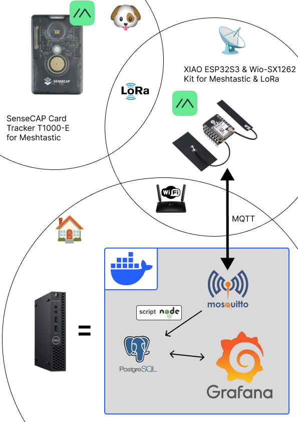
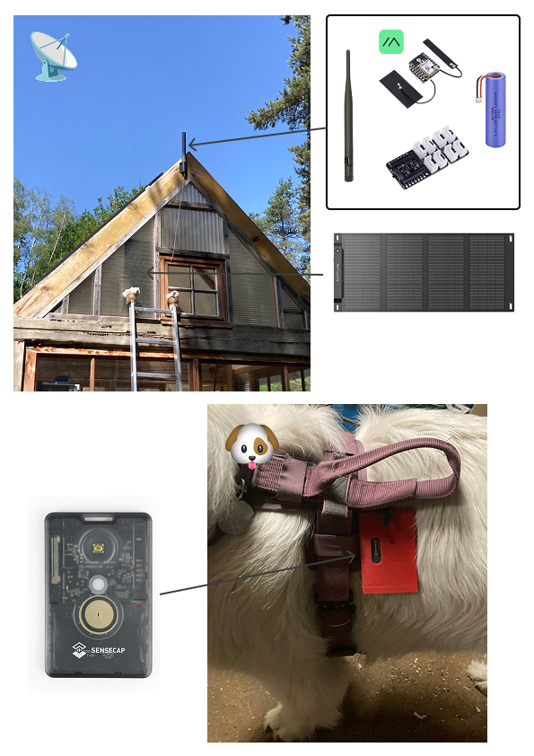
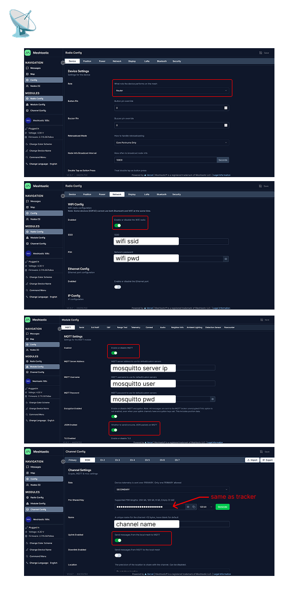
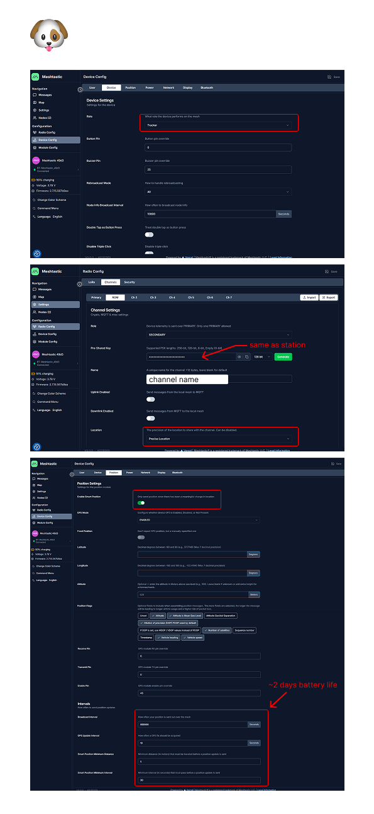
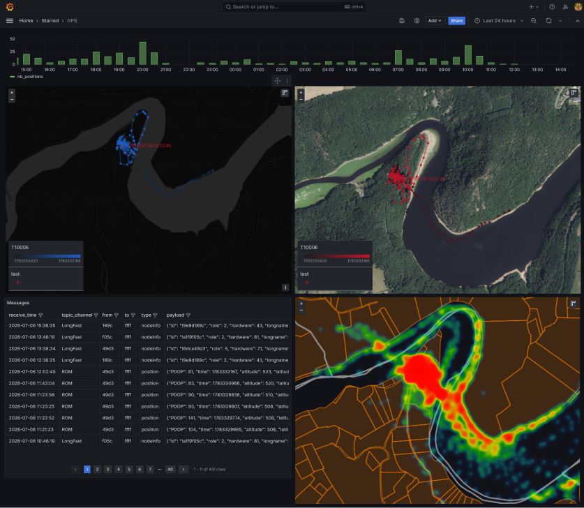

<div align="center">

# 🐶 Meshtastic to Grafana

**Real-time GPS tracking and position history, subscription-free, powered by Meshtastic**

[](LICENSE)
[](docker-compose.yml)
[](https://meshtastic.org)

[Version française](README.md)

</div>

---

## 📖 About

I built this project to track my dog in real time on a map, and to spot where he escapes from my property using a history of positions.

For this, I chose **Meshtastic**, a low-cost solution that requires no subscription.

The system is built around:
- a **SenseCAP Card Tracker T1000-E** GPS tracker;
- a base station made of a **XIAO ESP32S3** paired with a **Wio-SX1262 LoRa module**, connected to my Wi-Fi network.

The tracker sends its GPS coordinates on a private channel over the Meshtastic network. The base station receives this data and publishes it via **MQTT** to a **Mosquitto** broker. A Node.js script then reads the MQTT messages and stores them in a **PostgreSQL** database.

For the graphical interface, I use **Grafana**. It can't compete with a fully custom-built app, but it perfectly covers my needs without having to develop a dedicated interface.

Everything is self-hosted at home on a **Dell OptiPlex** mini-PC, running Grafana, the database, the Mosquitto broker, and the MQTT → DB script.

---

## 📐 Architecture

```
🐶 SenseCAP Card Tracker T1000-E
            │
            ▼
      🛜 Meshtastic network
            │
            ▼
📡 Meshtastic base station (XIAO ESP32S3 + Wio-SX1262)
            │
      🛜 Wi-Fi
            │
            ▼
🖥️ Server
      ├── Mosquitto (MQTT)
      ├── MQTT → DB script
      ├── Database (PostgreSQL)
      └── Grafana
            │
         🛜 HTTP(S)
            │
            ▼
🌍 Web client
```



---

## 🛠️ Hardware

| Hardware                       | Link                                                                                                   | Approx. price |
| -------------------------------- | --------------------------------------------------------------------------------------------------------- | --------------- |
| SenseCAP Card Tracker T1000-E    | [Seeed Studio](https://www.seeedstudio.com/SenseCAP-Card-Tracker-T1000-E-for-Meshtastic-p-5913.html)     | ~€40           |
| XIAO ESP32S3 + Wio-SX1262 kit    | [Seeed Studio](https://www.seeedstudio.com/Wio-SX1262-with-XIAO-ESP32S3-p-5982.html)                      | ~€10           |
| Grove Base for XIAO              | [Seeed Studio](https://www.seeedstudio.com/Grove-Shield-for-Seeeduino-XIAO-p-4621.html)                   | ~€4            |
| Battery                          | 3.7V LiPo or 18650 Li-ion                                                                                    | —              |



---

## 🚀 Quick start

Requirements: [Docker](https://docs.docker.com/get-docker/) and [Docker Compose](https://docs.docker.com/compose/install/).

```bash
git clone https://github.com/ltempier/MeshtasticToGrafana.git
cd MeshtasticToGrafana
cp ".env copy" .env    # fill in the variables (see below)
docker compose up -d
```

Once the containers are up:
- **Grafana** is available at `http://<server-address>:3000`
- **Mosquitto (MQTT)** listens on port `1883`
- **PostgreSQL** listens on port `5432`

> ℹ️ Adjust the exposed ports in `docker-compose.yml` to match your setup.

### Environment variables (`.env`)

| Variable                     | Description                        |
| ----------------------------- | ------------------------------------ |
| `MQTT_USER`                  | MQTT broker username                |
| `MQTT_PASS`                  | MQTT broker password                |
| `POSTGRES_USER`              | PostgreSQL user                     |
| `POSTGRES_PASSWORD`          | PostgreSQL password                 |
| `GF_SECURITY_ADMIN_PASSWORD` | Grafana admin password              |

```env
MQTT_USER="..."
MQTT_PASS="..."

POSTGRES_USER="..."
POSTGRES_PASSWORD="..."

GF_SECURITY_ADMIN_PASSWORD="..."
```

---

## 📡 Base station configuration

Meshtastic configuration of the base station (XIAO ESP32S3 + Wio-SX1262): role, radio region, private channel, Wi-Fi connection, and MQTT forwarding to the local broker.



---

## 🐶 Tracker configuration

Configuration of the **SenseCAP Card Tracker T1000-E**: private channel shared with the base station, position update interval, and power-saving mode.



---

## 🗄️ Database

The [`meshtastic.js`](node_scripts) script automatically creates the `messages` table on startup if it doesn't already exist:

| Column                                    | Description                                                                 |
| -------------------------------------------- | ------------------------------------------------------------------------------ |
| `id`                                       | Auto-incrementing identifier                                                  |
| `receive_time`                             | Server-side reception timestamp                                               |
| `topic` / `topic_channel` / `topic_node`   | Original MQTT topic and its parsed components                                 |
| `msg_id`                                   | Meshtastic packet ID                                                          |
| `from_node` / `to_node`                    | Numeric source/destination node identifiers                                   |
| `from_txt` / `to_txt`                      | Short hex form (last 4 characters), generated automatically                   |
| `type`                                     | Packet type (`position`, `nodeinfo`, `telemetry`, etc.)                       |
| `sender`                                   | Sending node identifier (`!xxxxxxxx`)                                         |
| `channel`                                  | Meshtastic channel                                                            |
| `hop_start` / `hops_away`                  | LoRa routing information                                                      |
| `node_ts`                                  | Timestamp reported by the node itself                                         |
| `payload`                                  | Full JSON body of the message (JSONB)                                         |

The tracked MQTT topic follows the standard Meshtastic format:

```
msh/<region>/<channel>/json/<...>/<node>
# e.g.: msh/EU_868/2/json/ROM/!9e9d189c
```

---

## 📊 Grafana visualization

Once data is stored in the database, build a Grafana dashboard pointing at the PostgreSQL datasource to display the real-time position on a map, along with the position history.



### SQL queries used

**Activity (number of positions over time)**

This query counts received positions, grouped by an adaptive time bucket (per minute, per 30-minute slot, or per hour depending on the range selected in Grafana). It powers a chart showing tracker activity (frequency of GPS reports) on a "time series" or "bar chart" panel.

```sql
SELECT
  CASE
    WHEN $__unixEpochTo() - $__unixEpochFrom() > 24 * 3600 THEN
      date_trunc('hour', receive_time)

    WHEN $__unixEpochTo() - $__unixEpochFrom() > 3 * 3600 THEN
      date_trunc('hour', receive_time)
      + floor(extract(minute FROM receive_time) / 30) * interval '30 minutes'

    ELSE
      date_trunc('minute', receive_time)
  END AS time,
  COUNT(*) AS nb_positions
FROM messages
WHERE $__timeFilter(receive_time)
  AND type = 'position'
  AND from_txt = '49d3'
GROUP BY 1
ORDER BY 1;
```

**GPS positions**

This query extracts latitude, longitude and altitude from `position` messages within the selected time range. It feeds a "Geomap" (or "Trail") panel to display the real-time position and the trip history on the map.

```sql
SELECT
  receive_time,
  EXTRACT(EPOCH FROM receive_time) AS ts_epoch,
  ((payload->>'latitude_i')::float / 10000000.0) AS latitude,
  ((payload->>'longitude_i')::float / 10000000.0) AS longitude,
  (payload->>'altitude')::float AS altitude
FROM messages
WHERE receive_time BETWEEN $__timeFrom() AND $__timeTo()
  AND type = 'position'
  AND from_txt = '49d3'
ORDER BY receive_time asc
LIMIT 1000000;
```

> ℹ️ `from_txt = '49d3'` filters on the short identifier of the sending node (here, the tracker). Replace this value with the last 4 characters of your own device's identifier.

---

## 📄 License

This project is distributed under the [MIT](LICENSE) license.